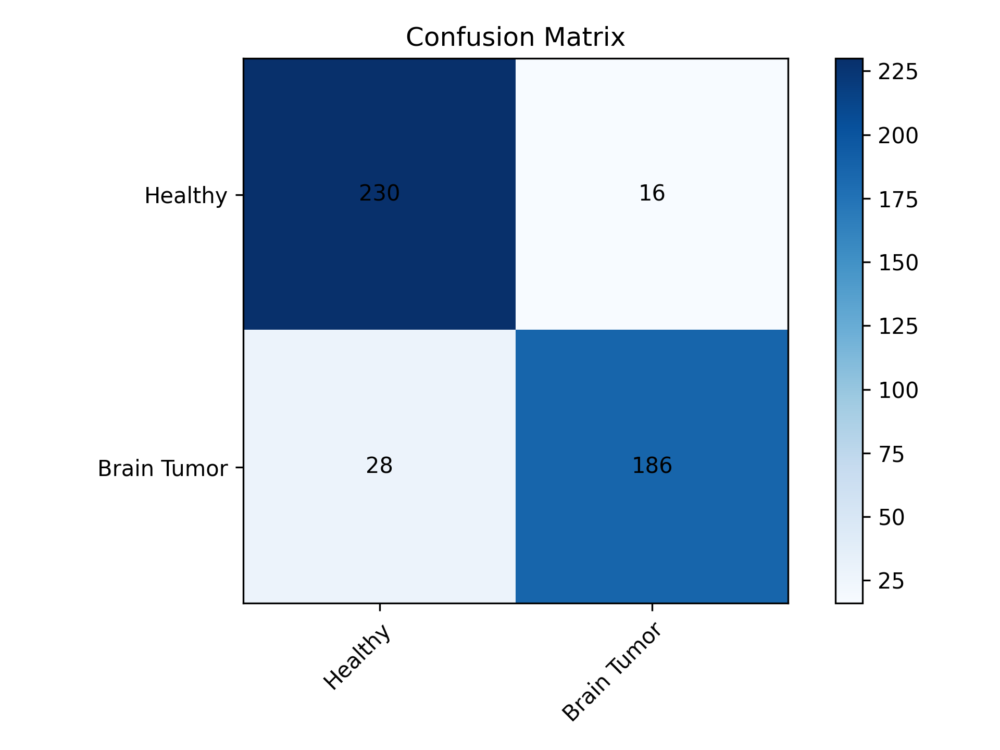

# Brain Tumor CNN

This project is a convolutional neural network (CNN) that classifies brain MRI images as either healthy or containing a brain tumor. The CNN is implemented using Keras with a TensorFlow backend.

## Dataset

The dataset used in this project is the Brain MRI Images for Brain Tumor Detection dataset from Kaggle. The dataset contains 253 MRI images in JPEG format, with 155 images containing brain tumors and 98 images without tumors.

## Model

The CNN model used in this project consists of five convolutional layers with ReLU activation, followed by max pooling layers and a fully connected layer with a softmax activation. The model is trained using the categorical cross-entropy loss function and the Adam optimizer.

## Results

The model achieves an accuracy of 87.5% on the test set, with a precision of 87.5% and a recall of 87.5%. The confusion matrix for the test set is shown below:

Here are 10 random images from the test set along with their predicted and true labels:

## Credits

This project was created by [Abdullah Al Omar Galib](https://www.linkedin.com/in/abdullah-al-omar-galib-30b6b1258/). The dataset used in this project was obtained from Kaggle.

## Versions
Versions of frameworks used in this code:
╒═════════════╤═══════════╕
│ Framework   │ Version   │
╞═════════════╪═══════════╡
│ Python      │ 3.11.5    │
├─────────────┼───────────┤
│ Pandas      │ 2.1.0     │
├─────────────┼───────────┤
│ NumPy       │ 1.23.5    │
├─────────────┼───────────┤
│ Matplotlib  │ 3.8.0     │
├─────────────┼───────────┤
│ OpenCV      │ 4.8.0     │
├─────────────┼───────────┤
│ Keras       │ 2.14.0    │
├─────────────┼───────────┤
│ TensorFlow  │ 2.14.0    │
├─────────────┼───────────┤
│ Seaborn     │ 0.12.2    │
╘═════════════╧═══════════╛